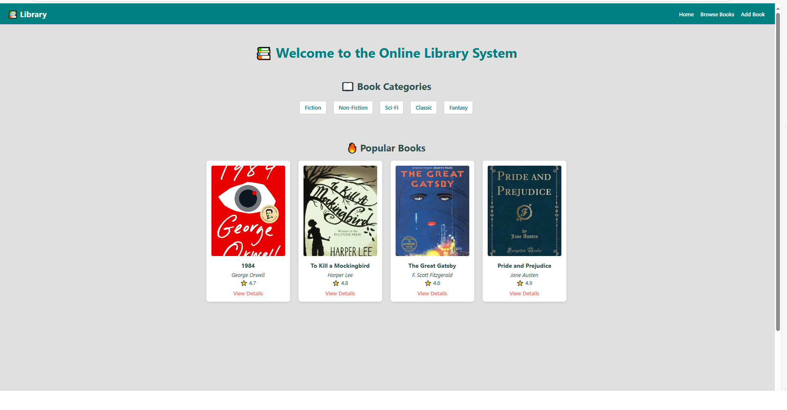
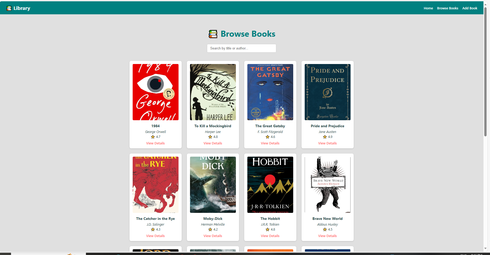
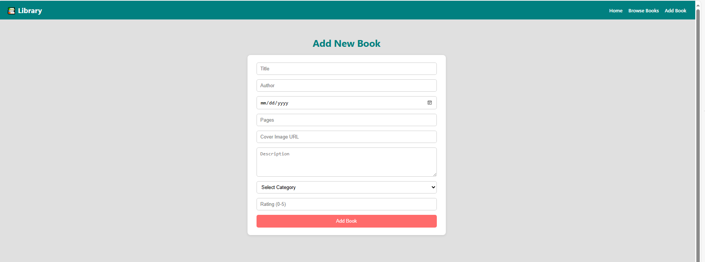
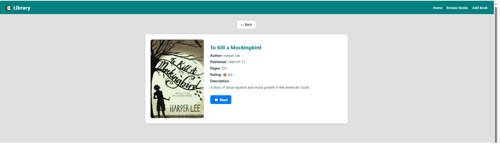
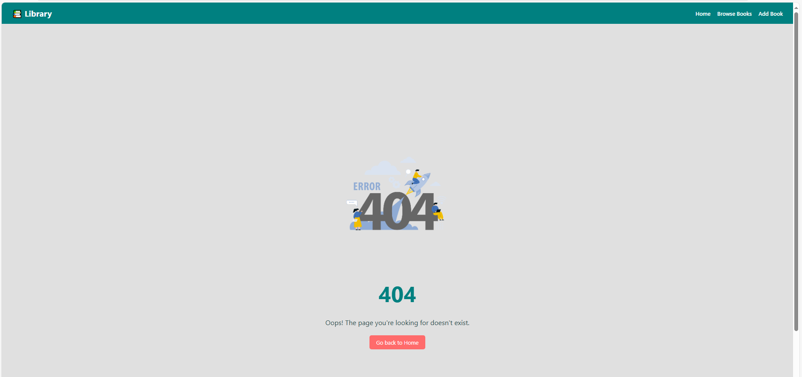

# 📚 Online Library System

An interactive, responsive web application built using **React + Redux** for managing and browsing books. Users can view, add, and explore detailed information about books across various categories.

 

---

## 🚀 Features

- 🏠 Home page with welcome banner, categories, and popular books
- 📚 Browse all books by category
- ➕ Add a new book (with form validation)
- 🧐 View detailed information on each book
- 📖 Read sample book (PDF) from detail page
- ❌ Custom 404 Not Found page
- ✨ Styled UI with soft teal theme and responsive design

---

## 🛠️ Tech Stack

| Frontend  | Description                     |
|-----------|---------------------------------|
| React     | Component-based UI              |
| Redux     | State management                |
| React Router | Client-side routing         |
| JavaScript | Core logic & interactions      |
| CSS       | Custom styling with theme colors|

---

## 📁 Folder Structure

online-library/
├── public/
├── src/
│ ├── assets/
│ ├── components/
│ ├── pages/
│ ├── redux/
│ ├── styles/
│ ├── App.js
│ └── index.js
├── .gitignore
├── README.md
└── package.json


---

## 🖥️ Getting Started

Follow these steps to set up the project locally:

### 1️⃣ Clone the repository

```bash
git clone https://github.com/RohanM0205/online-library.git
cd online-library
npm install
npm start

---

📷 Screenshots

### Home Page


### BrowseBooks Page


### Add Book Page


### BookDetails Page


### Not Found Page



---


🧑‍💻 Author
Rohan More

📄 License
This project is licensed under the MIT License — feel free to use, fork, or contribute.